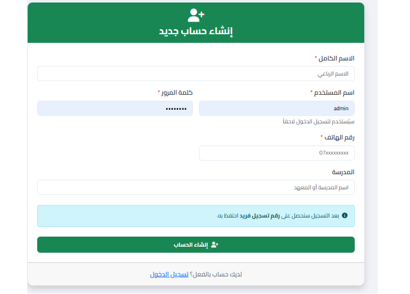
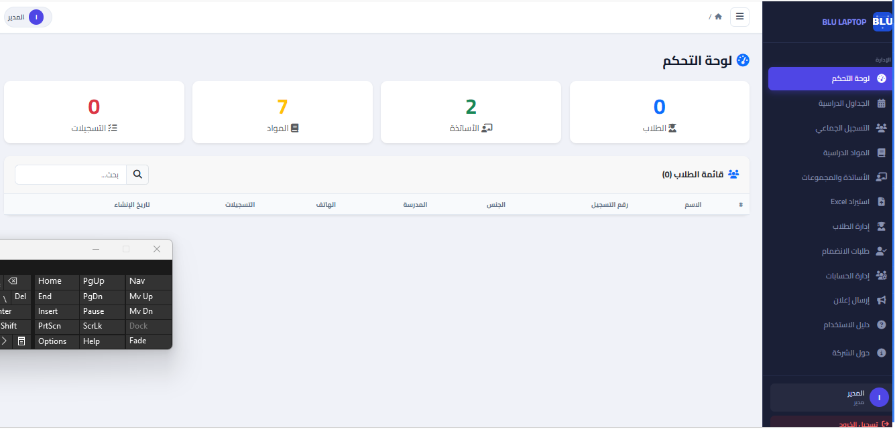
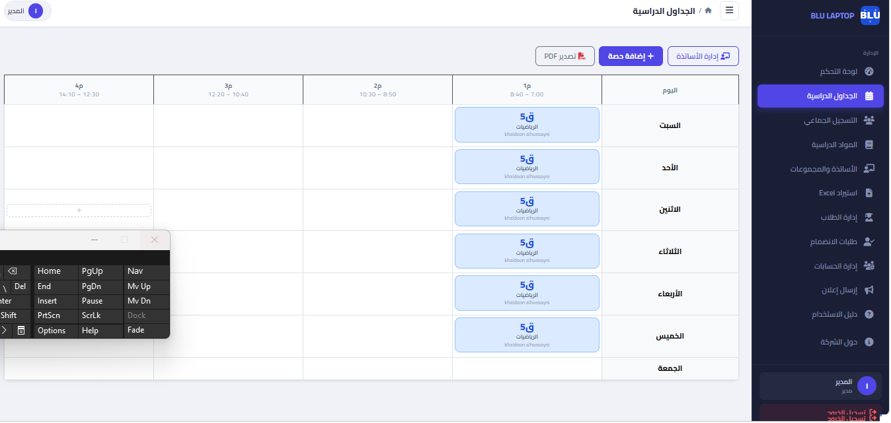
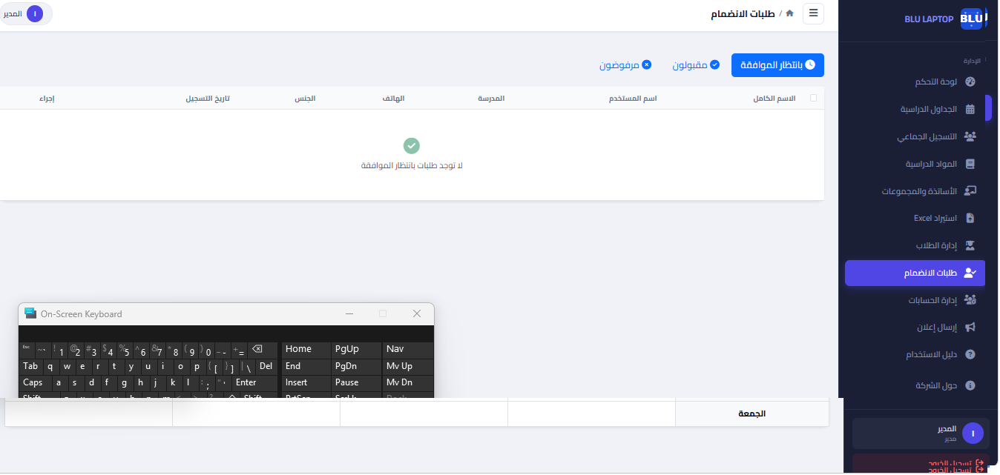
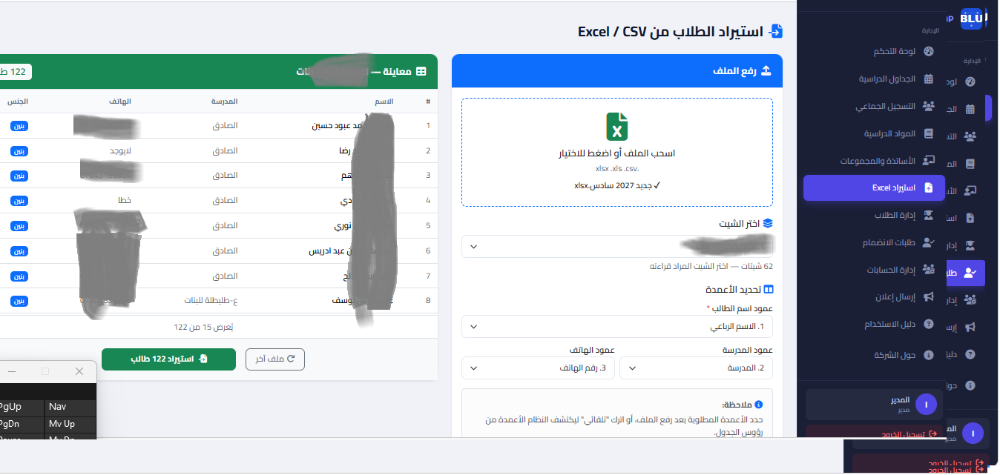
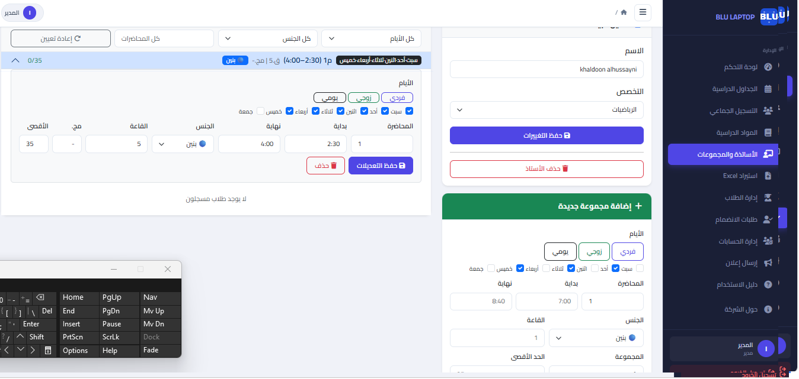
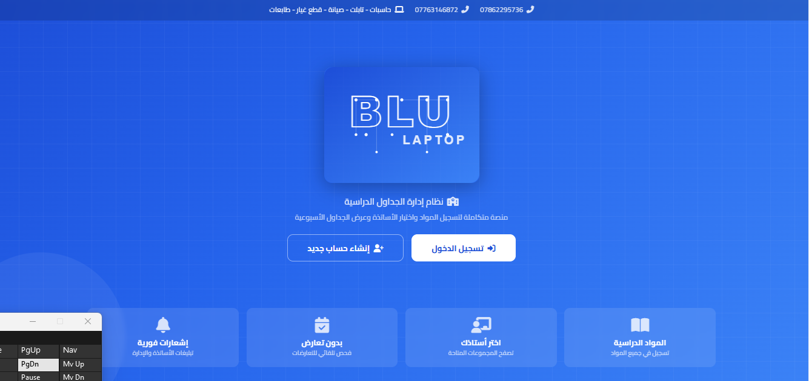

# BLU LAPTOP — School Schedule Management System

<div align="center">


**A full-featured Arabic RTL school scheduling platform**

[](https://python.org)
[](https://flask.palletsprojects.com)
[](https://getbootstrap.com)
[](LICENSE)

[Live Demo](https://Khaldoon.pythonanywhere.com) · [Report Bug](../../issues)

</div>

---

## Overview

A comprehensive web-based school scheduling system built for Iraqi schools. The platform manages classroom timetables, teacher assignments, student enrollments, and announcements — all in a fully Arabic RTL interface.

### Key Features

| Feature | Description |
|---------|-------------|
| **Weekly Schedule Grid** | Visual timetable — days as rows, periods as columns, room numbers centered |
| **Flexible Time Slots** | Custom days, periods, and start/end times per session |
| **Smart Import** | Excel/CSV import with column mapping, fuzzy Arabic duplicate detection (>=90%) |
| **Enrollment Management** | Bulk + individual enrollment with automatic conflict detection |
| **Approval System** | Admin-only student approval before platform access |
| **Announcements** | Teachers send announcements with real-time student notifications |
| **Multi-role Access** | Admin, Teacher, Student — each with tailored dashboard |
| **Account Management** | CRUD for all accounts with random password generation |
| **Subject Management** | Full CRUD for academic subjects |
| **PDF Export** | One-click PDF export of the full weekly schedule |

---

## Screenshots

### Landing Page
The public landing page with BLU LAPTOP branding, login/register buttons, and feature highlights.



### Admin Dashboard
Overview with student count, teacher count, subjects, and active enrollments.



### Weekly Schedule Grid
Days as rows, periods as columns. Room number displayed prominently in each cell. Hover to reveal edit/move/delete actions.



### Student Approval
Admin reviews pending registrations — approve, reject, or bulk-approve.



### Excel Import with Column Mapping
Upload Excel/CSV, select which columns map to name/school/phone, preview before import.



### Teacher Detail & Sessions
Manage teacher sessions with flexible day checkboxes, custom times, and enrolled student lists.



### About Page
Company profile with BLU LAPTOP visual identity, services, and contact info.



> **Note:** If screenshots are not available, run the app locally and visit each page.

---

## Tech Stack

| Layer | Technology |
|-------|-----------|
| **Backend** | Python 3.10+ · Flask 3.0 · Flask-Login · Flask-SQLAlchemy |
| **Database** | SQLite (local) — PostgreSQL ready via `DATABASE_URL` |
| **Frontend** | Bootstrap 5.3 RTL · Font Awesome 6 · Cairo Arabic Font |
| **Import** | openpyxl (Excel) · csv (CSV) |
| **PDF** | html2pdf.js (client-side) |
| **Hosting** | PythonAnywhere (free tier) |

---

## Architecture

```
app.py                  # Flask app — all routes, helpers, config
models.py               # SQLAlchemy models (7 tables)
static/
  css/style.css         # Full design system (SaaS dashboard style)
  images/               # Logo SVG, favicon
  js/main.js            # Shared JS utilities
templates/
  base.html             # Sidebar layout (admin/teacher/student nav)
  index.html            # Public landing page
  about.html            # Company profile page
  auth/                 # Login, Register
  admin/                # Dashboard, Schedule, Students, Teachers,
                        #   Subjects, Accounts, Approvals, Import,
                        #   Enrollments, Guide
  teacher/              # Dashboard, Announcements
  student/              # Dashboard, Schedule, Enroll, Announcements
```

### Database Schema

```
users              — id, username, password_hash, full_name, phone,
                     school, gender, role, status, reg_id, created_at
subjects           — id, name, order
teachers           — id, name, subject_id, user_id
teacher_sessions   — id, teacher_id, day_type, days, period,
                     start_time, end_time, room, gender,
                     group_name, max_students
enrollments        — id, student_id, session_id, subject_id,
                     enrolled_at, status
announcements      — id, author_id, title, body, target, created_at
notifications      — id, student_id, announcement_id, is_read, created_at
```

---

## Problems & Solutions

### 1. Arabic Fuzzy Name Matching
**Problem:** Duplicate students with slight name variations (diacritics, alef forms, ta marbuta).

**Solution:** Custom Arabic normalizer that strips tashkeel, unifies alef variants (أإآ→ا), ya (ئى→ي), ta marbuta (ة→ه), then uses `SequenceMatcher` with 90% threshold.

```python
def _norm_ar(text):
    text = re.sub(r'[ً-ٰٟ]', '', text)   # remove tashkeel
    text = re.sub(r'[أإآٱ]', 'ا', text)   # normalize alef
    text = re.sub(r'ؤ', 'و', text)
    text = re.sub(r'[ئى]', 'ي', text)
    text = re.sub(r'ة', 'ه', text)
    return text.strip().lower()
```

### 2. Large Excel Import Hanging
**Problem:** Importing 500+ students caused browser to freeze — entire dataset sent as JSON round-trip.

**Solution:** Server-side row caching. Preview endpoint saves parsed rows to `{token}.json` on disk; only first 15 rows sent to browser. Import endpoint reads from cached file.

### 3. Flexible Schedule (Days + Times)
**Problem:** Fixed odd/even day system with hardcoded 4-period times didn't fit all schools.

**Solution:** Added `days` column (comma-separated: `sat,sun,mon,...`) with preset buttons (odd/even/daily) + individual day checkboxes. Period number is a free input (1-20). Start/end times are editable with auto-suggested defaults.

### 4. Student Approval Flow
**Problem:** Anyone could register and immediately access the platform.

**Solution:** Self-registered students get `status='pending'`. Login blocked until admin approves. Admin-created/imported students auto-approved. Sidebar shows pending count badge.

### 5. Column Mapping for Excel Import
**Problem:** Excel files from different schools had columns in different orders.

**Solution:** After upload, the system reads the header row and shows 3 dropdown selectors (name/school/phone column). Auto-detects from Arabic keywords, user can override.

### 6. PythonAnywhere Deployment
**Problem:** Free tier has no console API access; `db.create_all()` only runs in `__main__` block.

**Solution:** Moved `db.create_all()` to module-level initialization. Added migration checks that auto-add new columns (`days`, `status`) via `ALTER TABLE` on first startup.

---

## Installation

### Prerequisites
- Python 3.10 or higher
- pip

### Local Setup

```bash
# Clone the repository
git clone https://github.com/YOUR_USERNAME/school-schedule.git
cd school-schedule

# Create virtual environment
python -m venv venv
source venv/bin/activate        # Linux/Mac
venv\Scripts\activate           # Windows

# Install dependencies
pip install -r requirements.txt

# Run the application
python app.py
```

Open `http://127.0.0.1:5000` in your browser.

### Default Admin Account
After first run, create an admin via Python shell:

```python
from app import app, db
from models import User
with app.app_context():
    u = User(username='admin', full_name='المدير', role='admin', status='approved')
    u.set_password('admin123')
    db.session.add(u)
    db.session.commit()
```

### Environment Variables

| Variable | Default | Description |
|----------|---------|-------------|
| `DATABASE_URL` | `sqlite:///school_schedule.db` | Database connection string |
| `SECRET_KEY` | `dev-secret-...` | Flask secret key |

---

## Deployment (PythonAnywhere)

1. Create a free account at [pythonanywhere.com](https://www.pythonanywhere.com)
2. Upload all project files to `/home/USERNAME/school_schedule/`
3. Create a web app (Flask, Python 3.10)
4. Set WSGI config to point to `app.py`
5. Reload — the app auto-creates tables on first request

---

## User Roles

### Admin
- Manage subjects, teachers, sessions, students, accounts
- Approve/reject student registrations
- Build and edit the weekly schedule
- Import students from Excel
- Bulk/individual enrollment with conflict detection
- Send announcements
- Export schedule to PDF

### Teacher
- View enrolled students per session
- Send announcements to targeted students

### Student
- Register and wait for admin approval
- View available subjects and enroll
- View personal weekly schedule
- Receive announcement notifications

---

## API Endpoints

| Method | Endpoint | Description |
|--------|----------|-------------|
| POST | `/api/import/detect` | Upload file, detect sheets |
| POST | `/api/import/preview` | Parse & preview with column mapping |
| POST | `/api/import/do` | Execute import with fuzzy dedup |
| POST | `/api/admin/check_student` | Fuzzy name + phone check |
| POST | `/api/admin/add_student` | AJAX add student |
| POST | `/api/admin/bulk_delete_students` | Bulk delete |
| POST | `/api/admin/approve/<id>` | Approve student |
| POST | `/api/admin/reject/<id>` | Reject student |
| POST | `/api/admin/bulk_approve` | Bulk approve/reject |
| POST | `/admin/sessions/<id>/move` | Move session (room/day/period) |
| GET | `/api/session/<id>` | Get session details |
| GET | `/api/notifications` | Get unread notifications |
| POST | `/teacher/announcements/add` | Post announcement |

---

## Results

- **452+ students** managed with zero duplicate entries
- **97 sessions** scheduled across 7 days with automatic conflict detection
- **27 teachers** linked to 7 subjects with flexible session management
- **< 3 seconds** Excel import for 500 rows with fuzzy matching
- **Zero downtime** deployment on PythonAnywhere free tier
- Full Arabic RTL support with responsive mobile layout

---

## License

This project is developed for **BLU LAPTOP** — All rights reserved.

---

<div align="center">
  <strong>BLU LAPTOP</strong> · Computers · Tablets · Maintenance · Spare Parts · Printers<br>
  📞 07862295736 · 07763146872
</div>
